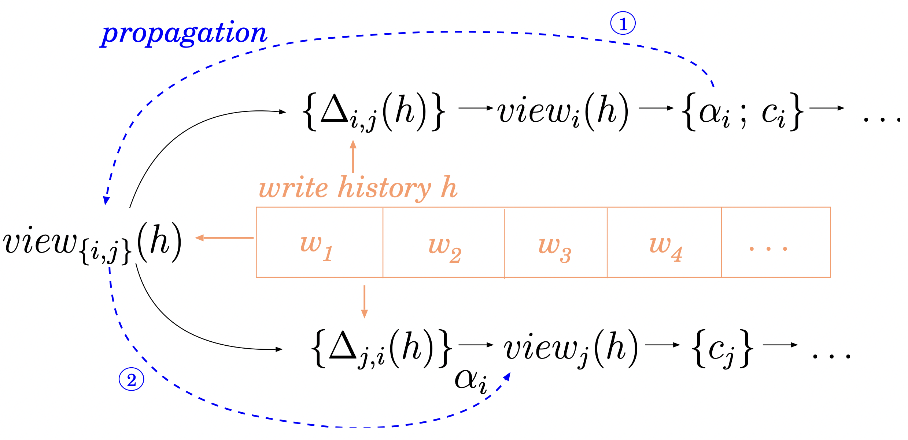

# Introduction

## Acknowledgment

These slides cover the following two papers on Compositional Reasoning for Weak Memory Models:

1. [Coughlin, Nicholas, Kirsten Winter, and Graeme Smith. "Compositional Reasoning for Non-Multicopy Atomic Architectures." Formal Aspects of Computing, December 14, 2022, 3574137.](https://doi.org/10.1145/3574137)

2. [Coughlin, Nicholas, Kirsten Winter, and Graeme Smith. "Rely/Guarantee Reasoning for Multicopy Atomic Weak Memory Models." In Formal Methods, edited by Marieke Huisman, Corina Păsăreanu, and Naijun Zhan, 292–310. Lecture Notes in Computer Science. Cham: Springer International Publishing, 2021.](https://doi.org/10.1007/978-3-030-90870-6_16)

Most of the content in the slides borrows from the papers. We acknowledge and thank the authors for this content, and for writing these wonderful papers.

## Rely/Guarantee Reasoning

- Verification of concurrent programs with shared resources is challenging due to **combinatorial explosion** 

- **Abstraction to the rescue!**

- Everything the environment can do: $\mathcal{R}$

- Everything you can do: $\mathcal{G}$

$$
\mathcal{R}, \mathcal{G} \vdash P \{\; c \;\} Q
$$ 

- *Compositional!*

## Extension to Weak Memory Models

- Judgements using earlier techniques are valid under **sequentially consistent semantics**
    - Can be directly used for data-race free code executing on weak memory models
    - But, lots of code has data races! `seqlock`, `ConcurrentLinkedQueue` in `java.util.concurrent` ...

- How do we extend them to weak memory models?

- What If: We could find a condition under which sequentially consistent rely-guarantee reasoning can be *soundly* preserved
     $$
     (\vdash P \{\; c \;\} Q) \,\land\, ?? \implies \vdash P \{\; c_{WM} \;\} Q
     $$ 

- Benefits:
    - Reuse existing verification techniques
    - Deal with the complexity of weak memory separately as a *side-condition*

## What are WMMs anyway?

- Relaxing the memory consistency guarantees provided by hardware enables optimisations
    - Store forwarding (will see later)
    - Write buffers

- (Part 1) **Multicopy Atomic**: One thread's stores become observable to all other threads at the same time.
    - x86-TSO, ARMv8, RISC-V

- (Part 2) **Non-Multicopy Atomic**: Each component has its own *view* of the global memory.
    - Older ARM versions, POWER, C11

- Challenge: Two types of interference now -- **Inter-Thread** + **Intra-Thread** (due to reordering)

- How will we deal with this? ...

## Teaser

- We want a compositional approach through thread-local reasoning.

- Exploit the reordering semantics of Colvin and Smith: **multicopy atomic
memory models can be captured in terms of instruction reordering.**
    - Combinatorial explosion? ($n$ reorderable instructions in a thread $\simplies$ $n!$ behaviours)
    - Introduce *reordering interference freedom* between ($\frac{n(n-1)}{2}$) pairs of instructions (Stay tuned...)

- In non-multicopy atomic WMMs, there is **no global shared state**(!!)
    - Judgement for each thread is applicable to *its view* (depends on *propagation* of writes by hardware)
    - How do we know it holds in other threads' views?
    - Represent the semantics using reordering **between** different threads
    - No longer compositional? Hardest part of the talk -- *global reordering interference freedom*: use the rely abstraction to represent reorderings between threads

# Abstract Language

## Syntax

- Individual (atomic) instructions $\alpha$

- Commands (or programs)

$$
c~:=~\epsilon~|~\alpha~|~c_1;c_2~|~c_1~\sqcap~c_2~|~c^{*}~|~c_1~||~c_2
$$ 

- Iteration, choice are non-deterministic

- Empty program $\epsilon$ represents termination

## Semantics: Commands

- Each atomic instruction $\alpha$ has a relation $\beh(\alpha)$ (over pre- and post-states) specifying its behaviour

- Program execution is defined by a small-step semantics over commands

- Iteration, non-deterministic choice are dealt with at a higher level (see next slide)

\begin{center}
\begin{tabular}{cc}
    \inference[]{}{\alpha \mapsto_{\alpha} \epsilon} & \inference[]{c_1 \mapsto_{\alpha} c_1'}{c_1;c_2 \mapsto_{\alpha} c_1';c_2} \\ \\
    \inference[]{c_1 \mapsto_{\alpha} c_1'}{c_1~||~c_2 \mapsto_{\alpha} c_1'~||~c_2} & \inference[]{c_2 \mapsto_{\alpha} c_2'}{c_1~||~c_2 \mapsto_{\alpha} c_1~||~c_2'}
\end{tabular}
\end{center}

## Semantics: Configurations

- *Configuration* $(c,\sigma)$ of a program
    - Command $c$ to be executed
    - State $\sigma$ (map from variables to values)

- *Action Step*: Performed by component, changes state
    $$
    (c,\sigma) \xrightarrow{as} (c',\sigma') \iff \exists \alpha. c \mapsto_{\alpha} c' \,\land\, (\sigma,\sigma') \in \beh(\alpha)
    $$ 

- *Silent Step*: Performed by component, doesn't change state
    $$
    (c_1 \sqcap c_2, \sigma) \rightsquigarrow (c_1,\sigma) \quad (c_1 \sqcap c_2, \sigma) \rightsquigarrow (c_2,\sigma)
    $$ 
    $$
    (c^{*},\sigma) \rightsquigarrow (\epsilon,\sigma) \quad (c^{*},\sigma) \rightsquigarrow (c;c^{*}, \sigma)
    $$ 

- *Program Step*: Action Step or Silent Step

- *Environment Step*: Performed by environment, changes state. $(c,\sigma) \xrightarrow{es} (c,\sigma')$.

# Basic Proof System

## Definitions

- Associate a verification condition $\vc(\alpha)$ with each instruction $\alpha$: Provides finer-grained control (just set to $\top$ if not needed)

- Hoare triple
$$
P \{\; \alpha \;\} Q \defeq P \subseteq \vc(\alpha) \cap \{ \sigma \,\mid\, \forall\, \sigma',\; (\sigma,\sigma') \in \beh(\alpha) \simplies \sigma' \in Q \}
$$ 

- A rely-guarantee pair $(\mathcal{R}, \mathcal{G})$ is well-formed if
    - $\mathcal{R}$ is reflexive and transitive
    - $\mathcal{G}$ is reflexive

- Stability of predicate $P$ under rely condition $\mathcal{R}$
$$
\stable_{\mathcal{R}}(P) \defeq P \subseteq \{\sigma \in P \,\mid\, \forall\, \sigma',\; (\sigma,\sigma') \in \mathcal{R} \simplies \sigma' \in P \}
$$ 

- Instruction $\alpha$ satisfies guarantee condition $\mathcal{G}$
$$
\sat(\alpha,\mathcal{G}) \defeq \{ \sigma \,\mid\, \forall\, \sigma',\; (\sigma,\sigma') \in \beh(\alpha) \simplies (\sigma,\sigma') \in \mathcal{G} \}
$$ 

- Now introduce rely/guarantee judgements at three levels

## Instruction Level ($\vdash_a$)

$$
\mathcal{R}, \mathcal{G} \vdash_a P \{\; \alpha \;\} Q \defeq \stable_{\mathcal{R}}(P) \,\land\, \stable_{\mathcal{R}}(Q) \,\land\, \vc(\alpha) \subseteq \sat(\alpha,\mathcal{G}) \,\land\, P \{\; \alpha \;\} Q
$$ 

- Interplay between environmental interference and pre-,post-conditions handled through stability

## Component Level ($\vdash_c$)

\begin{center}
    \begin{tabular}{c}
        \inference[Atom]{\mathcal{R},\mathcal{G} \vdash_a P \{\; \alpha \;\} Q}{\mathcal{R},\mathcal{G} \vdash_c P \{\; \alpha \;\} Q} 
    \\ \\   \inference[Seq]{\mathcal{R},\mathcal{G} \vdash_c P \{\; c_1 \;\} M \quad \mathcal{R},\mathcal{G} \vdash_c M \{\; c_2 \;\} Q}{\mathcal{R},\mathcal{G} \vdash_c P \{\; c_1;c_2 \;\} Q} \\ \\
        \inference[Choice]{\mathcal{R},\mathcal{G} \vdash_c P \{\; c_1 \;\} Q \quad \mathcal{R},\mathcal{G} \vdash_c P \{\; c_2 \;\} Q}{\mathcal{R}, \mathcal{G} \vdash_c P \{\; c_1~\sqcap~c_2 \;\} Q}
    \\ \\   \inference[Iteration]{\mathcal{R},\mathcal{G} \vdash_c P \{\; c \;\} P \quad \stable_{\mathcal{R}}(P)}{\mathcal{R},\mathcal{G} \vdash_c P \{\; c^{*} \;\} P} \\ \\
        \inference[Conseq]{\mathcal{R},\mathcal{G} \vdash_c P \{\; c \;\} Q \quad P' \subseteq P \quad \mathcal{R'} \subseteq \mathcal{R} \quad Q \subseteq Q' \quad \mathcal{G} \subseteq \mathcal{G'}}{\mathcal{R'}, \mathcal{G'} \vdash_c P' \{\; c \;\} Q'}
    \end{tabular}
\end{center}

## Global Level ($\vdash$)

- Global satisfiability needs component satisfiability + **interference check**
$$
\inference[Comp]{\mathcal{R}, \mathcal{G} \vdash_c P \{\; c \;\} Q \quad \rif(\mathcal{R},\mathcal{G},c)}{\mathcal{R},\mathcal{G} \vdash P \{\; c \;\} Q}
$$ 

- Usual parallel rule
$$
\inference[Par]{\mathcal{R}_1, \mathcal{G}_1 \vdash_c P_1 \{\; c_1 \;\} Q_1 \quad \mathcal{R}_2, \mathcal{G}_2 \vdash_c P_2 \{\; c_2 \;\} Q_2 \quad \mathcal{G}_2 \subseteq \mathcal{R}_1 \quad \mathcal{G}_1 \subseteq \mathcal{R}_2}{\mathcal{R}_1 \cap \mathcal{R}_2,\mathcal{G}_1 \cup \mathcal{G}_2 \vdash P_1 \land P_2 \{\; c_1~||~c_2 \;\} Q_1 \land Q_2}
$$

# Multicopy Atomic Memory Models

## Reordering Semantics: Basics

- Multicopy atomic memory models can be characterised using a *reordering* relation $\hookleftarrow$ over pairs of instructions in a component

- $\hookleftarrow$ is syntactically derivable based on the specific memory model. E.g., in ARMv8
    - Two instructions which don't access (read or write) a common variable can be reordered
    - Various types of memory barriers prevent reordering

- *Forwarding* is another complication
    - $\beta = \texttt{x := 3} ; \alpha = \texttt{y := x}$. Can forward the value $3$ to $y$, losing dependence between $\alpha,\beta$.
    - `x := 3 ; y := x` $\Longrightarrow$ `y := 3 ; x := 3`
    - Denote $\alpha$ with the value written in an earlier instruction forwarded to it as $\alpha_{<\beta>}$.

- Forwarding may continue arbitrarily and can span multiple instructions

## Reordering Semantics: Formal

- $\alpha_{<c>}$: cumulative forwarding effects of the instructions in command $c$ on $\alpha$

- Ternary relation $\gamma < c < \alpha$: Reordering of instruction $\alpha$ prior to command $c$, with cumulative forwarding effects producing $\gamma$.

- Definition by induction
\begin{align*}
\alpha_{<\beta>} < \beta < \alpha &\defeq \beta \hookleftarrow \alpha_{<\beta>} \\
\alpha_{<c_1;c_2>} < c_1;c_2 < \alpha &\defeq \alpha_{<c_1;c_2>} < c_1 < \alpha_{<c_2>} \,\land\, \alpha_{<c_2>} < c_2 < \alpha
\end{align*}

- Example: $\alpha = (\texttt{y := x}), \beta = (\texttt{x := 3}), \gamma = (\texttt{z := 5})$. $\alpha_{<\beta>} = (\texttt{y := 3})$,$\alpha_{<\gamma ; \beta>} = (\texttt{y := 3})$.
    $$
    \texttt{y := 3} < \texttt{x := 3} < \texttt{y := x} \text{  and  } \texttt{y := 3} < \texttt{z := 5 ; x := 3} < \texttt{y := x}
    $$

- Can execute an instruction which occurs later in the program if reordering and forwarding can bring it (in its new form $\gamma$) to the beginning
$$
\inference[Reorder]{c_2 \mapsto_{\alpha} \quad \gamma < c < \alpha}{c_1 ; c_2 \mapsto_{\gamma} c_1 ; c_2'}
$$ 

## Reordering Interference Freedom

- Insight: Any valid reordering will **preserve thread-local semantics**, thus may only invalidate reasoning when **observed by the environment**.

    - Abstraction to the rescue again! Observed by environment $\simplies$ $\mathcal{G}$ violated, or $\mathcal{R}$ not strong enough

- Three Levels: Instructions, Commands, Program

## RIF: Instructions

- Two instructions are *reordering interference free*: Reasoning over them in their original order is sufficient to include reordered behaviour.

\begin{align*}
\rif_a(\mathcal{R}, \mathcal{G}, \beta, \alpha) \defeq& \forall\, P,Q,M .\; \mathcal{R},\mathcal{G} \vdash_a P \{\;\beta\;\} M \,\land\, \mathcal{R},\mathcal{G} \vdash_a M \{\;\alpha\;\} Q \\
&\simplies \exists M'.\; \mathcal{R},\mathcal{G} \vdash_a P \{\;\alpha_{<\beta>}\;\} M' \,\land\, \mathcal{R},\mathcal{G} \vdash_a M' \{\;\beta\;\} Q
\end{align*}

## RIF: Commands

- Command $c$ is *reordering interference free* from $\alpha$ under $\mathcal{R},\mathcal{G}$ if the reordering of $\alpha$ over each instruction of $c$ is reordering interference free, *including those variants produced by forwarding*.

\begin{align*}
    \rif_c(\mathcal{R}, \mathcal{G}, \beta, \alpha) &\defeq \rif_a(\mathcal{R}, \mathcal{G}, \beta, \alpha) \\
    \rif_c(\mathcal{R}, \mathcal{G}, c_1;c_2, \alpha) &\defeq \rif_c(\mathcal{R}, \mathcal{G}, c_1, \alpha_{<c_2>}) \,\land\, \rif_c(\mathcal{R}, \mathcal{G}, c_2, \alpha)
\end{align*}

## RIF: Programs

- Program $c$ is *reordering interference free* if and only if **all possible reorderings** of its instructions over the respective prefixes are reordering interference free.

$$
\rif(\mathcal{R},\mathcal{G},c) \defeq \forall \alpha,r,c' .\; c \mapsto_{\alpha_{<r>}} c' \simplies \rif_c(\mathcal{R},\mathcal{G}, r, \alpha) \,\land\, \rif(\mathcal{R},\mathcal{G},c')
$$ 

- Observe: Checking $\rif(\mathcal{R},\mathcal{G},c)$ amounts to
    - Checking $\rif_a(\mathcal{R},\mathcal{G},\beta,\alpha)$ for all pairs of instructions $\beta,\alpha$ that can reorder in $c$
    - Including those pairs for which $\alpha$ is a new instruction generated through forwarding

## Gameplan

1. Compute all pairs of reorderable instructions $(\beta,\alpha)$.

2. Demonstrate reordering interference freedom for as many of these pairs as possible (using $\rif_a(\mathcal{R}, \mathcal{G}, \beta, \alpha)$).

3. If $\rif_a$ cannot be shown for some pairs
    - introduce memory barriers to prevent their reordering or
    - modify the verification problem such that their reordering can be considered benign

4. Verify the component in isolation, using standard rely/guarantee reasoning with an assumed sequentially consistent memory model.

For a thread with $n$ reorderable instructions,

$n!$ Possible Behaviours $\longrightarrow$ $n(n-1) / 2$ $\rif_a$ checks 

Thanks for staying tuned : )

# Non-Multicopy Atomic Memory Models

- There is **no shared state** that all components agree on throughout execution, invalidating a core
assumption of standard rely/guarantee reasoning.

## Write History Semantics: Representation

- Each component is associated with a unique identifier.

- Shared memory state is represented as a list of variable writes $<w_1,w_2,w_3, \dots>$, with metadata to indicate which components have performed and observed particular writes.

- The order of events in this write history provides an *overall order* to the system’s events, with those later in the list being the most recent.

- Each $w_i = (x \mapsto v)^{wr}_{rds}$ where
    - $x$ is a variable
    - $v$ is a value
    - $\writer((x \mapsto v)^{wr}_{rds}) = wr$ is the writer component's identifier
    - $\readers((x \mapsto v)^{wr}_{rds}) = rds$ is the set of component identifiers that have observed the write
    - $\var((x \mapsto v)^{wr}_{rds}) = x$

## Write History Semantics: Manipulation

- Divide instructions into two types: *global* and *local*. Global instructions $\alpha$ are:
    - Store $(x := v)_i$, Load $[x = v]_i$, Memory barrier $\text{fence}_i$, Skip instruction (corresponding to some internal step)

- Behaviour of these instructions is formalised as (for skip it's just $id$):
\begin{align*}
    \beh((x := v)_i) &= \{\; (h \circ h', h \circ (x \mapsto v)^i_{\{i\}} \circ h') \mid \\
    &\forall w \in h'.\; \writer(w) \neq i \,\land\, (\var(w)=x \simplies i \not\in \readers(w)) \;\} \\
    \beh([x = v]_i) &= \{\; (h \circ (x \mapsto v)^j_r \circ h', h \circ (x \mapsto v)^j_r \circ h') \mid \\
    &\forall w \in h'.\; (\var(w)=x \simplies i \not\in \readers(w)) \\
    \beh(\text{fence}_i) &= \{\; (h , h) \mid \forall w \in h.\; (i \in \readers(w) \simplies \forall y .\, y \in \readers(w)) \;\}
\end{align*}

- Propagations of writes are modelled as environment effects and can take place at any point during the execution.
\begin{align*}
    \prp &= \{\; (h \circ (x \mapsto v)^j_r \circ h', h \circ (x \mapsto v)^j_{r \cup \{i\}} \circ h') \mid \\
    &i \not\in r \,\land\, \forall w \in h.\; (\var(w)=x \simplies i \in \readers(w)) \;\}
\end{align*}

## More Notation

- New constructor in the language: $\comp(i,m,c)$ indicating a component with
    - identifier $i$
    - local state $m$
    - command $c$

- Assume a local behaviour relation $\lbeh$ such that $(m,\alpha',m') \in \lbeh(\alpha)$ if executing $\alpha$
    - changes the local state from $m$ to $m'$
    - corresponds to the global instruction $\alpha'$

$$
\comp(i,m,c) \mapsto_{\alpha_i'} \comp(i,m',c') \iff c \mapsto_{\alpha} c' \,\land\, (m,\alpha',m') \in \lbeh(\alpha)
$$ 

- Go from local semantics/reasoning to global semantics/reasoning using $\comp$ and $\lbeh$.
    - Constraint: systems are constructed as the parallel composition of a series of comp commands.
    - Trivial support for local state (e.g., hardware registers).

## Meaning of Judgement

- If there is no global state, what does $\mathcal{R},\mathcal{G} \vdash P \{\; c \;\} Q$ (for a component $i$ with command $c$) mean?

- For a set of components $I$, write history $h$, for all variables $x$, $\view_I(h,x) = v$ iff
$$
h = h' \circ (x \mapsto v)^w_r \circ h'' \,\land\, I \subseteq r \,\land\, \forall w_i \in h''.\; \var(w_i)=x \simplies I \not\subseteq \readers(w_i)
$$ 

- For all executions of $c$
    - If
        - the execution operates on a write history $h$ such that $\view_i(h) \in P$
        - all propagations to $i$ modify $\view_i$ in accordance with $\mathcal{R}$
    - Then $i$ will
        - modify $\view_i$ in accordance with $\mathcal{G}$
        - given termination, end with a write history $h$ such that $\view_i(h) \in Q$

- This state mapping allows for rely/guarantee judgements **over individual components** to be trivially lifted from a standard memory model to their respective views of a write history.

## Parallel Composition: Taming the Beast

- Parallel composition is complicated: **Need to relate differing components views**.

- *If* the execution of an instruction $\alpha$ by some component $i$ satisfies its guarantee specification $\mathcal{G}_i$ in state $h$,
$$
\view_i(h) \in \sat(\alpha,\mathcal{G}_i)
$$ 

- *Then* the effects of propagating $\alpha$’s writes to some other component $j$ will satisfy its rely specification $\mathcal{R}_j$ in its view,
$$
\view_j(h) \in \sat(\alpha,\mathcal{R}_j)
$$ 

- Insight: It is possible to relate the views of two components by only considering the **difference in their observed writes**, i.e., the writes one component has observed but the other has not.

## Travelling Between Components

\fontsize{10}{8}\selectfont

- Aim to demonstrate rely/guarantee compatibility when propagating an instruction $\alpha$ from component $i$ to component $j$
    - Given: component $i$ executes $\alpha$ such that $\view_i(h) \in \sat(\alpha,\mathcal{G}_i)$.
    - Step 1: Show that $\alpha$ can be executed in the shared view, i.e., $\view_{\{i,j\}}(h) \in \sat(\alpha,\mathcal{G}_i)$.
    - Step 2: Show that $\alpha$ can be executed in component $j$'s view, i.e., $\view_{j}(h) \in \sat(\alpha,\mathcal{G}_i)$.

## Travelling to Shared View Through Non $i,j$ Writes

- Prove step 1 by induction on length of $\Delta_{i,j}(h)$.
    - Base case trivial ($\view_{\{i,j\}}(h) = \view_i(h)$).
    - Induction step:
        - The write cannot be from $j$ since $j$ hasn't observed it.
        - If the write is from $i$, then the reordering of $\alpha$ before it has been covered in multicopy reordering interference freedom.
        - If the write is from some $k \neq i,j$, then we do what follows.

- Have some relation $\mathcal{E}$ intended to capture the possible writes $i$ may have observed ahead of $j$
$$
\rif_{nmca}(\mathcal{E}, \alpha,\mathcal{G}_i) = wp(\mathcal{E}, \sat(\alpha,\mathcal{G}_i)) \subseteq \sat(\alpha,\mathcal{G}_i)
$$ 

- Proving this for $\mathcal{E} = \mathcal{R}_i \cap \mathcal{R}_j \cap id_{\alpha}$ is sufficient.

## Endgame

- Define a compatibility relation by universally quantifying over all writes
\begin{align*}
& \compat(\mathcal{G}_i, \mathcal{R}_i, \mathcal{R}_j) \defeq \forall x,v. \\
& wp(\mathcal{R}_i \cap \mathcal{R}_j \cap id_x, \sat(\texttt{x := v}, \mathcal{G}_i)) \subseteq \sat(\texttt{x := v}, \mathcal{R}_j)
\end{align*}

- Modify the rules for parallel composition (note that we need separate relies and guarantees for each component because demonstrating compat requires pairwise checking)
\begin{align*}
    & \inference[Comp']{\mathcal{R},\mathcal{G} \vdash_c P \{\; c \;\} Q \quad \rif(\mathcal{R}, \mathcal{G}, c)}{[i \mapsto \mathcal{R}], [i \mapsto \mathcal{G}] \vdash P \{\; \comp(i,m,c) \;\} Q} \\ \\
    & \inference[Par']{\mathcal{R}_1, \mathcal{G}_1 \vdash P_1 \{\; c_1 \;\} Q_1 \quad \mathcal{R}_2, \mathcal{G}_2 \vdash P_2 \{\; c_2 \;\} Q_2 \quad \mathrm{disjoint}(\mathcal{R}_1,\mathcal{R}_2) \\ \\ \\ \\
    \forall i \in \mathrm{dom}(\mathcal{R}_1).\, \forall j \in \mathrm{dom}(\mathcal{R}_2) .\; \compat(\mathcal{G}_1(i), \mathcal{R}_1(i), \mathcal{R}_2(j)) \\ \\ \\ \\
    \forall i \in \mathrm{dom}(\mathcal{R}_2).\, \forall j \in \mathrm{dom}(\mathcal{R}_1) .\; \compat(\mathcal{G}_2(i), \mathcal{R}_2(i), \mathcal{R}_1(j)) \\ \\}
    {
    \mathcal{R}_1 \uplus \mathcal{R}_2, \mathcal{G}_1 \uplus \mathcal{G}_2 \vdash P_1 \land P_2 \{\; c_1~||~c_2 \;\} Q_1 \land Q_2 
    }
\end{align*}
